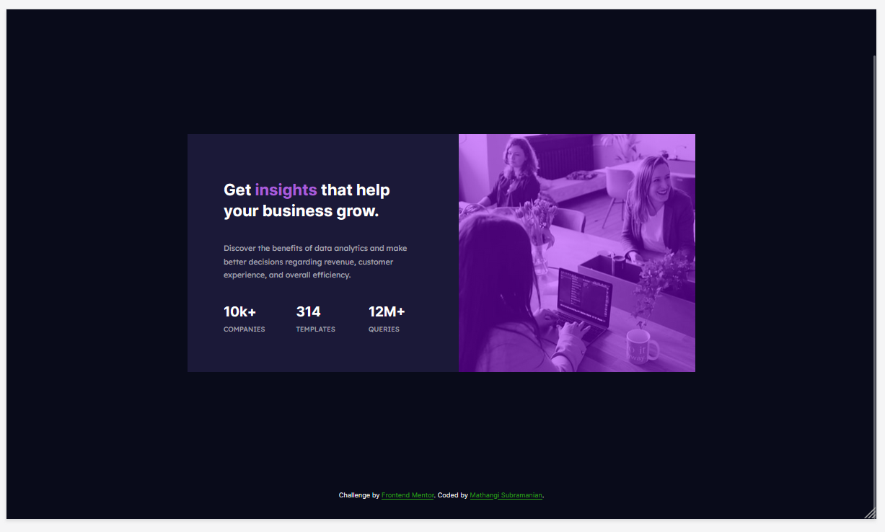
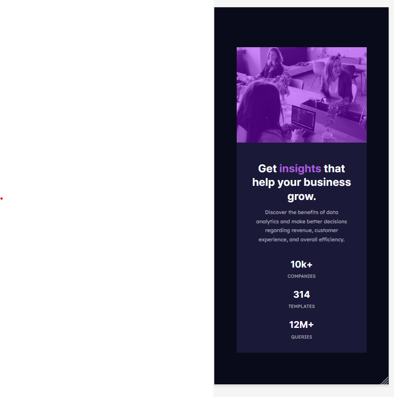

# Frontend Mentor - Stats preview card component solution

This is a solution to the [Stats preview card component challenge on Frontend Mentor](https://www.frontendmentor.io/challenges/stats-preview-card-component-8JqbgoU62). Frontend Mentor challenges help you improve your coding skills by building realistic projects. 

- [Overview](#overview)
  - [The challenge](#the-challenge)
  - [Screenshot](#screenshot)
  - [Links](#links)
- [My process](#my-process)
  - [Built with](#built-with)
  - [What I learned](#what-i-learned)
  - [Continued development](#continued-development)
  - [Useful resources](#useful-resources)
- [Author](#author)
- [Acknowledgments](#acknowledgments)

## Overview
### The challenge

Users should be able to:

- View the optimal layout depending on their device's screen size

### Screenshot

### 
Desktop view
 

### 
Mobile View
 

# 
### Links

- Solution URL : [Git URL](https://github.com/mathangisd/stats-preview.git)

- Live URL : [Stats Preview Card Component on Netlify](https://stats-preview-msd.netlify.app/)

## My process
### Built with

- Semantic HTML5 markup
- CSS custom properties
- CSS Grid

### What I learned

I was able to practice media query and grid properties. 

### Continued-Development
I would like to keep working on other projects that involve different responsive layouts.

### Useful resources

- [3 ways to Tint image](https://cssfox.co/=maxim-aginsky/log/three-ways-to-tint-image-with-css3-box-shadow-multiple-backgrounds-and-pseudo-elements) by Maxim Aginsky

## Author
- Website - [Mathangi Subramanian](https://github.com/mathangisd)
- Frontend Mentor - [mathangisd](https://www.frontendmentor.io/profile/mathangisd)

## Acknowledgments
Thank you to anyone for giving any feedback, it is always helpful to know how the code could be improved.